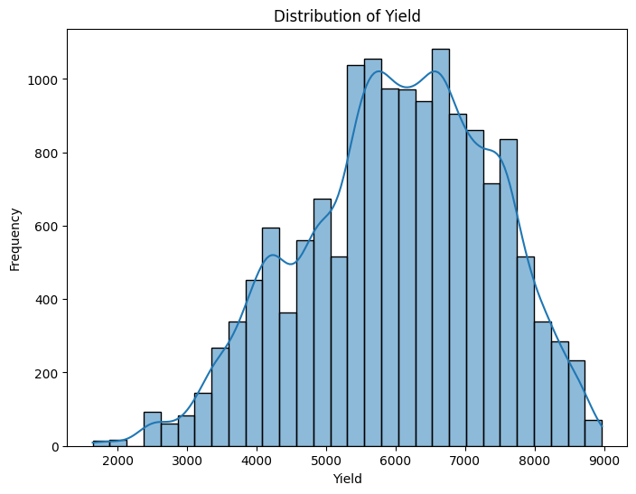
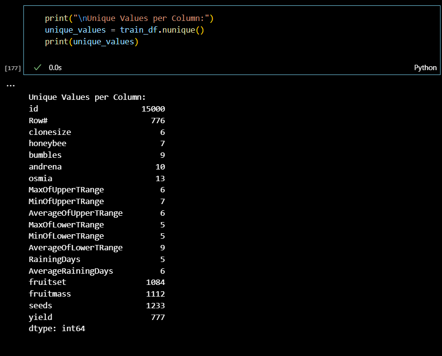
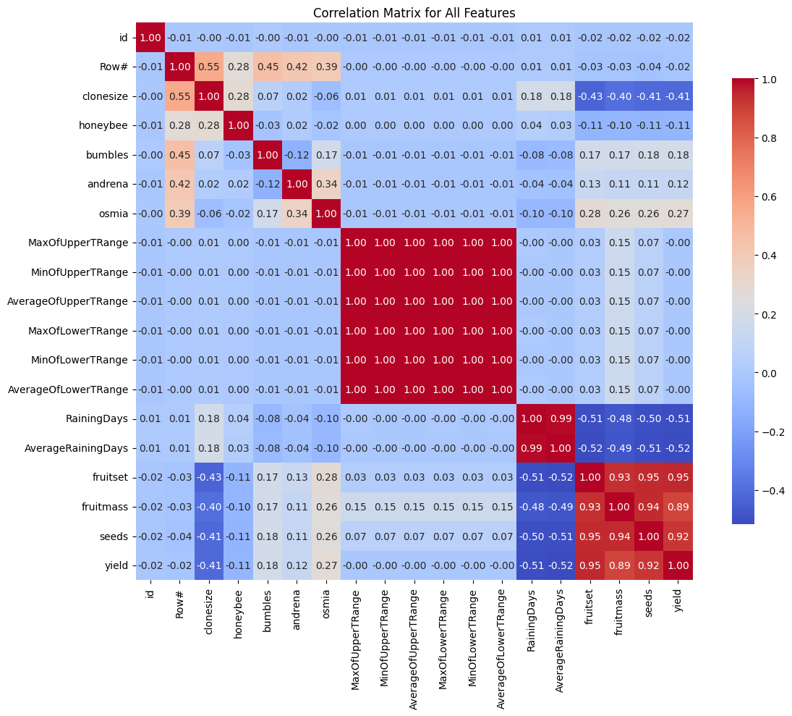

Here’s a more detailed README that includes dataset information and the initial data processing steps.

---

# Advanced Model Pipeline for Yield Prediction

This project provides a machine learning pipeline for predicting the `yield` feature in a dataset. The approach leverages ensemble modeling, feature engineering, and hyperparameter tuning with Optuna to minimize the Mean Absolute Error (MAE) and generate an optimized submission file for a Kaggle competition.

## Table of Contents

1. [Overview](#overview)
2. [Dataset Information](#dataset-information)
3. [Features](#features)
4. [Setup and Requirements](#setup-and-requirements)
5. [Pipeline Details](#pipeline-details)
   - [Data Preprocessing](#data-preprocessing)
   - [Exploratory Data Analysis (EDA)](#exploratory-data-analysis-eda)
   - [Feature Engineering](#feature-engineering)
   - [Model Ensemble](#model-ensemble)
   - [Hyperparameter Tuning](#hyperparameter-tuning)
   - [Evaluation](#evaluation)
6. [Running the Code](#running-the-code)
7. [Results and Output](#results-and-output)
8. [Acknowledgments](#acknowledgments)

---

## Overview

This code constructs a regression model to predict the target variable, `yield`, using advanced ensemble techniques. It incorporates feature engineering, recursive feature elimination (RFE), and a combination of Voting and Stacking Regressors to improve model performance. Optuna is used for hyperparameter optimization, making the pipeline flexible and adaptable.

## Dataset Information

The dataset used in this project is structured as follows:

- **train.csv**: Contains the training data, with the following columns:
  - `id`: Unique identifier for each observation.
  - `yield`: Target variable representing yield (continuous numeric).
  - Additional features, including variables related to agricultural metrics such as `clonesize`, `honeybee`, `bumbles`, `andrena`, `osmia`, `RainingDays`, and others.

- **test.csv**: Contains test data with the same features as `train.csv`, excluding `yield`.

### Initial Data Inspection

The pipeline begins by loading and inspecting the data to understand its structure and identify any preprocessing needs. This includes checking for null values, data types, and basic statistics.

**Code Snippet**:

```python
# Loading data
train_data = pd.read_csv('train.csv')
test_data = pd.read_csv('test.csv')

# Display initial information about the datasets
print("Train Dataset Info:")
print(train_data.info())
print("\nTest Dataset Info:")
print(test_data.info())

# Display summary statistics for numerical features
print("\nTrain Dataset Description:")
print(train_data.describe())
```

---






## Features

- **Exploratory Data Analysis (EDA)**: Visualizes data distributions and relationships to inform feature engineering.
- **Advanced Feature Engineering**: Introduces meaningful interaction terms and transformations to boost model performance.
- **Model Ensemble**: Combines Voting and Stacking Regressors with various base models.
- **Hyperparameter Tuning with Optuna**: Optimizes model parameters using Optuna's TPE sampler.
- **MAE Evaluation**: Assesses model performance with cross-validated Mean Absolute Error (MAE) scoring.
- **Submission File Generation**: Produces predictions in the required format for Kaggle submission.

## Setup and Requirements

The code requires Python and the following main libraries:

- `pandas`
- `numpy`
- `scikit-learn`
- `optuna`
- `logging`
- `matplotlib`
- `seaborn`

Install the required libraries with:

```bash
pip install pandas numpy scikit-learn optuna matplotlib seaborn
```

## Pipeline Details

### Data Preprocessing

The first processing steps include handling missing values, encoding categorical variables, and any necessary data cleaning. Additionally, data transformations like log and polynomial features are applied to normalize skewed distributions and capture non-linear relationships.

**Code Snippet**:

```python
# Example of log transformation for skewed features
skewed_features = ['fruitmass', 'seeds', 'RainingDays']
for col in skewed_features:
    if col in train_data.columns:
        train_data[f'log_{col}'] = np.log1p(train_data[col])
        test_data[f'log_{col}'] = np.log1p(test_data[col])
```

### Exploratory Data Analysis (EDA)

Before modeling, it's essential to understand the data through EDA. This process includes visualizing distributions, relationships, and identifying potential issues.

**1. Distribution of `yield`:**

```python
import matplotlib.pyplot as plt
import seaborn as sns

plt.figure(figsize=(10, 6))
sns.histplot(train_data['yield'], bins=30, kde=True)
plt.title('Distribution of Yield')
plt.xlabel('Yield')
plt.ylabel('Frequency')
plt.show()
```

*Figure 1: Distribution of Yield*

**2. Pairplot of Features:**

```python
sns.pairplot(train_data[['seeds', 'fruitmass', 'clonesize', 'yield']])
plt.suptitle('Pairplot of Features', y=1.02)
plt.show()
```

*Figure 2: Pairplot of Features*

### Feature Engineering

Feature engineering steps are designed to enhance the model’s predictive power. Here are the key steps:

1. **Interaction Terms**: Combines `seeds` and `fruitmass` to create `fruit_density`.
2. **Log Transformations**: Applies log transformations to skewed features (`fruitmass`, `seeds`, `RainingDays`).
3. **Polynomial Features**: Generates second-degree polynomial features on important interactions.

### Model Ensemble

The pipeline includes an ensemble of models within both Voting and Stacking Regressors:

- **Ridge Regression**
- **Lasso Regression**
- **ElasticNet**
- **Support Vector Regressor (SVR)**
- **K-Nearest Neighbors (KNN)**
- **Decision Tree Regressor**
- **Random Forest Regressor**

These models are configured with Optuna-tuned parameters, then combined into a Voting Regressor and a Stacking Regressor. The ensemble is trained and evaluated using cross-validation to identify the optimal model for final predictions.

### Hyperparameter Tuning

Optuna is used for hyperparameter tuning. The tuning process includes:

1. **ElasticNet**: Tuning `alpha` and `l1_ratio`.
2. **SVR**: Tuning `C` and `epsilon`.
3. **KNN**: Tuning `n_neighbors`.
4. **Decision Tree**: Tuning `max_depth` and `min_samples_split`.
5. **Random Forest**: Tuning `n_estimators` and `max_depth`.

### Evaluation

The code evaluates model performance through 10-fold cross-validation with MAE scoring. After tuning, it compares the MAE of Voting and Stacking Regressors and selects the model with the lowest MAE for final predictions.

## Running the Code

1. **Prepare the Data**: Ensure `train.csv` and `test.csv` files are in the working directory with the expected format.

2. **Run the Code**:

   - Execute the script directly from the terminal or an IDE. The code will automatically:

     - Perform feature engineering.
     - Optimize hyperparameters using Optuna.
     - Evaluate model performance.
     - Generate a submission file named `submission_advanced_model11.csv`.

3. **Submission File**:

   - The final predictions are saved in `submission_advanced_model11.csv` in the format required for Kaggle submission.

## Results and Output

The pipeline outputs:

- **Best Trial Parameters**: Displays the best parameters found by Optuna.
- **Best MAE**: The lowest MAE achieved through tuning.
- **Voting and Stacking Regressor MAE**: Compares the MAE of both ensemble models.
- **Submission File**: Saves the test predictions in `submission_advanced_model11.csv`.

## Acknowledgments

- **Optuna** for hyperparameter tuning.
- **Scikit-Learn** for providing comprehensive model and preprocessing utilities.
- **Pandas** and **NumPy** for data manipulation.
- **Matplotlib** and **Seaborn** for data visualization.

This pipeline is designed for efficient training and testing to deliver competitive performance on yield prediction tasks.

--- 


By following these steps, you'll have a well-structured and informative README file that effectively communicates the purpose, methodology, and usage of your Smoking Status Prediction project. This will not only help others understand your work but also make it easier for collaborators to contribute.
